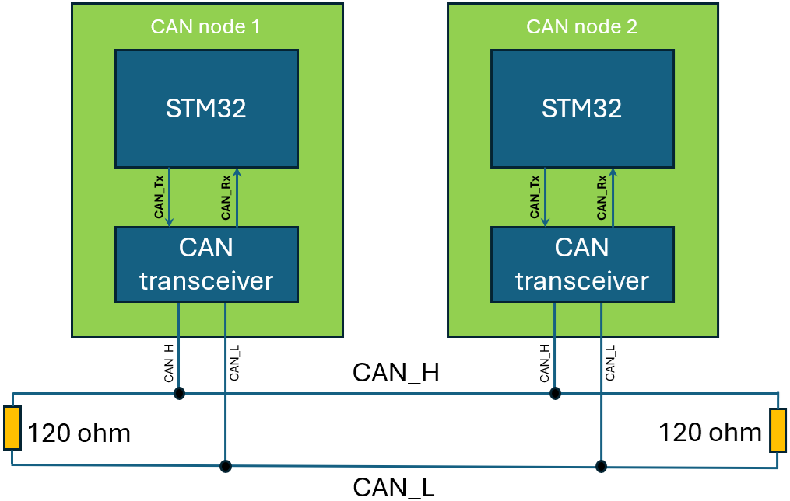
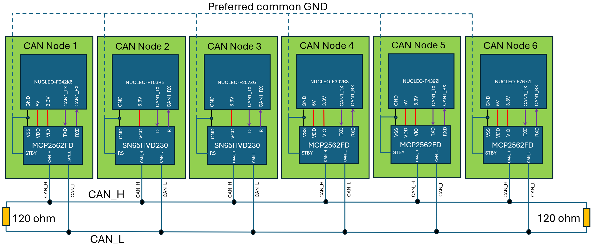
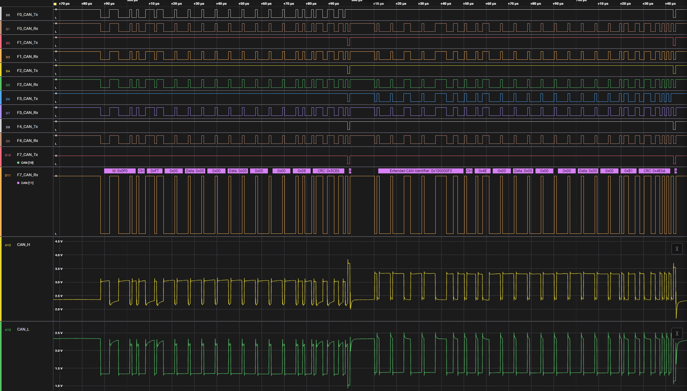

# bxCAN in Normal mode on several STM32 platforms

## Summary

The purpose of this example is to provide the bxCAN configuration in Normal mode on different platforms.

## Hardware

This example is provided for the following platforms and can be tailored for any other STM32 platform, provided the MCU features an FDCAN interface:
* NUCLEO-F042K6 (STM32F042K6)
* NUCLEO-F103RE (STM32F103RE)
* NUCLEO-F207ZG (STM32F207ZG)
* NUCLEO-F302R8 (STM32F302R8)
* NUCLEO-F439ZI (STM32F439ZI)
* NUCLEO-F767ZI (STM32F767ZI)

The example can be tailored to any MCU featuring CAN interface.

## How to use this example
* Hardware:
  A minimal hardware is required to establish a CAN communication in Normal mode. The minimal hardware required is shown as the following figure:
  
  To run the complete example on all the boards listed above, this is how to establish the connection:
   
* Software:  
Build the project corresponding to the available STM32 boards, then load the generated image into memory. 
After compiling the project and staring the debug, you can add the TxData and RxData to the “Live Expressions” to check how they will be updated during the application running.
If you have a logic analyzer featuring a CAN analyzer you can probe the transmitted and received CAN frames respectively on CAN_Tx and CAN_Rx pins.

## Frames captured by Saleae Logic analyzer on all Nucleo boards
This is what is expected to see with the logic analyzer or an oscilloscope on CAN_Tx/CAN_Rx pins as well as CAN_H/CAN_L lines:

## Additional resources

Please refer to [this](NOT YET DEFINED) article for the the hardware setup and software configuration to correctly run correctly the example.

## Questions & Feedback

Please refer to the [CONTRIBUTING.md](CONTRIBUTING.md) guide.
